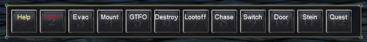

---
tags:
  - plugin
resource_link: "https://www.redguides.com/community/resources/mq2mybuttons.145/"
support_link: "https://www.redguides.com/community/threads/mq2mybuttons.66854/"
repository: "https://github.com/RedGuides/MQ2MyButtons"
config: "MQ2MyButtons.ini"
authors: "Knightly, Timplo, riddlerr, eqmule, ChatWithThisName"
tagline: "Adds an extra row of buttons which you can assign any command you like"
---

# MQ2MyButtons

<!--desc-start-->
MQ2MyButtons adds an extra row of buttons which you can assign any command you like. It's especially useful for long commands.
<!--desc-end-->



## Commands

<a href="cmd-mybuttons/">

</a>
:     {{ readMore('projects/mq2mybuttons/cmd-mybuttons.md') }}

## Settings

Upon loading the plugin (`/plugin mq2mybuttons load`) an MQ2MyButtons.ini file will be created in your Release folder. Edit the file to add new buttons:

```ini
[UISettings]
WindowTitle=MQ2 MyButton Window
Locked=0
Fades=0
Delay=0
Duration=500
Alpha=255
FadeToAlpha=255
BGType=1
BGTint.alpha=255
BGTint.red=255
BGTint.green=255
BGTint.blue=255
ShowWindow=1
[Location]
Top=594
Bottom=646
Left=6
Right=519
[Button1]
Label=Help
Command=/mybuttons help
Red=255
Green=255
Blue=153
[Button2]
Label=Kiss
Command=/mac kissassist
Red=207
Green=6
Blue=16
```

## Troubleshooting

- If you don't see the buttons window, it's likely behind another window.
- If you still don't see it, try a `/reload` and then `/mybuttons on`
- If you **still** don't see it, edit the .ini file to change its location.

## Top-Level Objects

## [MyButtons](tlo-mybuttons.md)
 {{ readMore('projects/mq2mybuttons/tlo-mybuttons.md') }}

## DataTypes

## [MyButtons](datatype-mybuttons.md)
 {{ readMore('projects/mq2mybuttons/datatype-mybuttons.md') }}

<h2>Members</h2>


